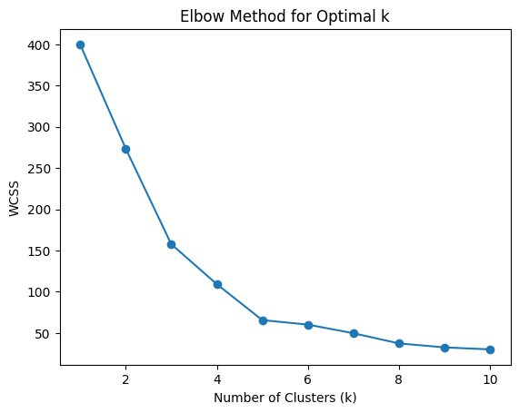
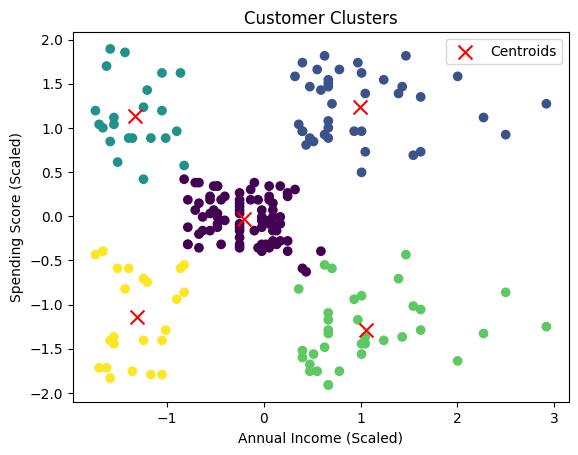

# SpendWise Segmentation Tool

SpendWise is a Flask-based web application for customer segmentation using K-Means clustering. Users can input their annual income and spending score to discover their customer segment. The model was trained from scratch using Google Colab, with visual proof of the elbow method and cluster analysis included.

---

## Features

- Predicts customer segment based on annual income and spending score.
- K-Means model.
- Visualizations: Elbow method and cluster plot included.
- Simple web interface built with Flask and HTML.

---

## Requirements

All required Python libraries are listed in [requirements.txt](requirements.txt):

- Flask
- joblib
- pandas
- numpy
- matplotlib (for visualizations)

---

## Installation

1. **Clone the repository:**
   ```sh
   git clone https://github.com/yourusername/spendwise-segmentation.git
   cd spendwise-segmentation
   ```

2. **Install dependencies:**
   ```sh
   pip install -r requirements.txt
   ```

3. **Ensure the following files are present in the project directory:**
   - `kmeans_model.pkl` (K-Means model trained in Google Colab)
   - `scaler.pkl` (Scaler fitted in Google Colab, see below)
   - `app.py`
   - `templates/index.html`
   - `visualizations/elbow_method.png` (Elbow method plot)
   - `visualizations/clusters.png` (Cluster visualization)

---

## About `scaler.pkl`

The `scaler.pkl` file contains a fitted data scaler (such as `StandardScaler` or `MinMaxScaler` from scikit-learn) that was used to normalize the input features (`Annual Income (k$)` and `Spending Score (1-100)`) before training the K-Means model.

**Why is this important?**
- Scaling ensures that both features contribute equally to the clustering process.
- When making predictions, user inputs are scaled using this same scaler to match the data distribution used during training.
- This guarantees accurate and consistent segmentation results.

If you retrain the model, always fit a new scaler on your training data and save it as `scaler.pkl`.

---

## About the Elbow Method

The **elbow method** is a technique used to determine the optimal number of clusters for K-Means clustering.

**How does it work?**
- The method involves running K-Means clustering on the dataset for a range of values of `k` (number of clusters).
- For each value of `k`, the sum of squared distances (inertia) between data points and their assigned cluster centers is calculated.
- These inertia values are plotted against the corresponding `k` values.
- As `k` increases, inertia decreases, but after a certain point, the rate of decrease sharply slows down—this point is called the "elbow."
- The "elbow" indicates the optimal number of clusters, as adding more clusters beyond this point does not significantly improve the model.

**Why is this important?**
- Choosing the right number of clusters is crucial for meaningful segmentation.
- The elbow method provides a visual and quantitative way to select the best `k` for your data.

---

## Usage

1. **Run the Flask app:**
   ```sh
   python app.py
   ```

2. **Open your browser and go to:**
   ```
   http://127.0.0.1:5000/
   ```

3. **Enter the required details (Annual Income and Spending Score) and click "Check" to see the predicted customer segment.**

---

## Model Training & Visualizations

The K-Means model was trained from scratch in Google Colab. Below are the visual proofs:

### Elbow Method



### Cluster Visualization



---

## License

This project is licensed under the [MIT License](LICENSE).

---

**Note:**  
Ensure `kmeans_model.pkl` and `scaler.pkl` are compatible with the input features:  
- `Annual Income (k$)`
- `Spending Score (1-100)`

If you need to retrain the model, use the same feature names and scaling as in the original
